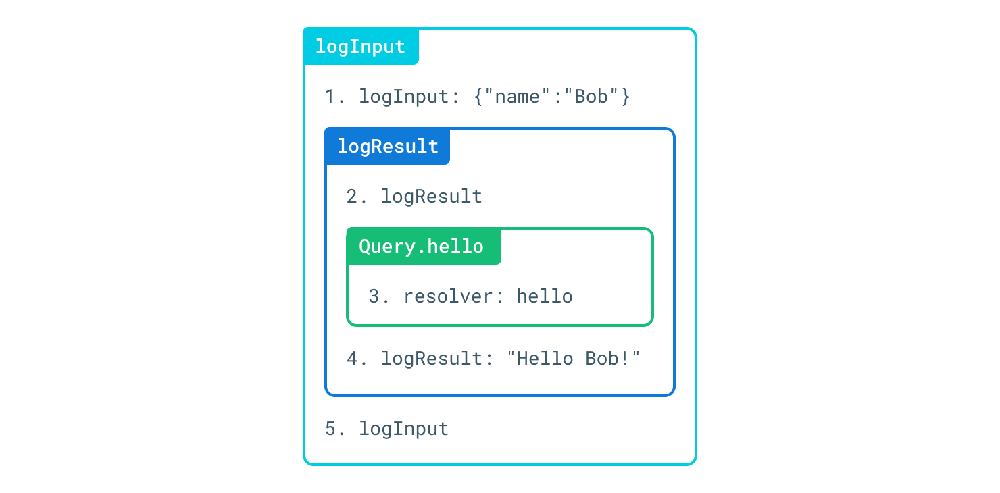

<p align="center"></p>

# graphql-middleware

[](https://github.com/maticzav/graphql-middleware/actions)
[](https://codecov.io/gh/maticzav/graphql-middleware)
[](https://badge.fury.io/js/graphql-middleware)

Split up your GraphQL resolvers in middleware functions.

## Overview

GraphQL Middleware is a schema wrapper which allows you to manage additional functionality across multiple resolvers efficiently.

- 💡 **Easy to use:** An intuitive, yet familiar API that you will pick up in a second.
- 💪 **Powerful:** Allows complete control over your resolvers (Before, After).
- 🌈 **Compatible:** Works with any GraphQL Schema.

> **NOTE:** As of 3.0.0 `graphql-middleware` no longer wraps introspection queries.

> **NOTE:** As of 5.0.0 `graphql-middleware` no longer supports GraphQL Yoga out of the box. We might bring back the support if the library becomes maintained again. We are keeping the docs as the reference for older versions.

## Install

```sh
yarn add graphql-middleware
```

## How does it work

GraphQL Middleware lets you run arbitrary code before or after a resolver is invoked. It improves your code structure by enabling code reuse and a clear separation of concerns.

```ts
const { ApolloServer } = require('apollo-server')
const { makeExecutableSchema } = require('@graphql-tools/schema')

const typeDefs = `
type Query {
  hello(name: String): String
  bye(name: String): String
}
`
const resolvers = {
  Query: {
    hello: (root, args, context, info) => {
      console.log(`3. resolver: hello`)
      return `Hello ${args.name ? args.name : 'world'}!`
    },
    bye: (root, args, context, info) => {
      console.log(`3. resolver: bye`)
      return `Bye ${args.name ? args.name : 'world'}!`
    },
  },
}

const logInput = async (resolve, root, args, context, info) => {
  console.log(`1. logInput: ${JSON.stringify(args)}`)
  const result = await resolve(root, args, context, info)
  console.log(`5. logInput`)
  return result
}

const logResult = async (resolve, root, args, context, info) => {
  console.log(`2. logResult`)
  const result = await resolve(root, args, context, info)
  console.log(`4. logResult: ${JSON.stringify(result)}`)
  return result
}

const schema = makeExecutableSchema({ typeDefs, resolvers })

const schemaWithMiddleware = applyMiddleware(schema, logInput, logResult)

const server = new ApolloServer({
  schema: schemaWithMiddleware,
})

await server.listen({ port: 8008 })
```

Execution of the middleware and resolver functions follow the "onion"-principle, meaning each middleware function adds a layer before and after the actual resolver invocation.

<p align="center"></p>

> The order of the middleware functions in the middlewares array is important. The first resolver is the "most-outer" layer, so it gets executed first and last. The second resolver is the "second-outer" layer, so it gets executed second and second to last... And so forth.

> You can read more about GraphQL Middleware in this fantastic [article](https://www.prisma.io/blog/graphql-middleware-zie3iphithxy/).

## Standalone usage

```ts
const { ApolloServer } = require('apollo-server')
const { makeExecutableSchema } = require('@graphql-tools/schema')

// Minimal example middleware (before & after)
const beepMiddleware = {
  Query: {
    hello: async (resolve, parent, args, context, info) => {
      // You can use middleware to override arguments
      const argsWithDefault = { name: 'Bob', ...args }
      const result = await resolve(parent, argsWithDefault, context, info)
      // Or change the returned values of resolvers
      return result.replace(/Trump/g, 'beep')
    },
  },
}

const typeDefs = `
  type Query {
    hello(name: String): String
  }
`
const resolvers = {
  Query: {
    hello: (parent, { name }, context) => `Hello ${name ? name : 'world'}!`,
  },
}

const schema = makeExecutableSchema({ typeDefs, resolvers })

const schemaWithMiddleware = applyMiddleware(
  schema,
  metricsMiddleware,
  authMiddleware,
  beepMiddleware,
)

const server = new ApolloServer({
  schema: schemaWithMiddleware,
})

await server.listen({ port: 8008 })
```

### Usage with `graphql-yoga`

> `graphql-yoga` has built-in support for `graphql-middleware`!

```ts
import { GraphQLServer } from 'graphql-yoga'
import { authMiddleware, metricsMiddleware } from './middleware'

const typeDefs = `
  type Query {
    hello(name: String): String
  }
`
const resolvers = {
  Query: {
    hello: (parent, { name }, context) => `Hello ${name ? name : 'world'}!`,
  },
}

const server = new GraphQLServer({
  typeDefs,
  resolvers,
  middlewares: [authMiddleware, metricsMiddleware],
  documentMiddleware: [],
})
server.start(() => console.log('Server is running on localhost:4000'))
```

## Awesome Middlewares [](https://awesome.re)

- [graphql-shield](https://github.com/maticzav/graphql-shield) - Permissions as another layer of abstraction.
- [graphql-middleware-apollo-upload-server](http://github.com/homeroom-live/graphql-middleware-apollo-upload-server) - Uploading files is hard, that's why this package manages it for you!
- [graphql-middleware-sentry](https://github.com/maticzav/graphql-middleware-sentry) - Report your server errors to Sentry.
- [graphql-middleware-forward-binding](https://github.com/maticzav/graphql-middleware-forward-binding) - GraphQL Binding forwardTo plugin for GraphQL Middleware.
- [graphql-yup-middleware](https://github.com/JCMais/graphql-yup-middleware) - Use yup to validate mutation arguments
- [graphql-pino-middleware](https://github.com/addityasingh/graphql-pino-middleware) - GraphQL middleware to augment resolvers with pino logger
- [graphql-lightstep-middleware](https://github.com/addityasingh/graphql-lightstep-middleware) - GraphQL middleware to instrument resolvers with `lightstep` traces
- [graphql-filter](https://github.com/hata6502/graphql-filter) - A GraphQL middleware to filter output data.

## API

A middleware is a resolver function that wraps another resolver function.

```ts
export declare type IMiddlewareResolver<
  TSource = any,
  TContext = any,
  TArgs = any
> = (
  resolve: Function,
  parent: TSource,
  args: TArgs,
  context: TContext,
  info: GraphQLResolveInfo,
) => Promise<any>

export interface IMiddlewareWithOptions<
  TSource = any,
  TContext = any,
  TArgs = any
> {
  fragment?: IMiddlewareFragment
  fragments?: IMiddlewareFragment[]
  resolve?: IMiddlewareResolver<TSource, TContext, TArgs>
}

export type IMiddlewareFunction<TSource = any, TContext = any, TArgs = any> =
  | IMiddlewareWithOptions<TSource, TContext, TArgs>
  | IMiddlewareResolver<TSource, TContext, TArgs>

interface IMiddlewareTypeMap {
  [key: string]: IMiddlewareFunction | IMiddlewareFieldMap
}

interface IMiddlewareFieldMap {
  [key: string]: IMiddlewareFunction
}

type IMiddleware = IMiddlewareFunction | IMiddlewareTypeMap

function middleware(
  generator: (schema: GraphQLSchema) => IMiddleware,
): MiddlewareGenerator

function applyMiddleware(
  schema: GraphQLSchema,
  ...middleware: (IMiddleware | MiddlewareGenerator)[]
): GraphQLSchema & {
  schema?: GraphQLSchema
  fragmentReplacements?: FragmentReplacement[]
}

/**
 * Applies middleware to a schema like `applyMiddleware` but only applies the
 * middleware to fields that have non-default resolvers. This method can be
 * useful if you want to report performance of only non-trivial methods.
 */
function applyMiddlewareToDeclaredResolvers(
  schema: GraphQLSchema,
  ...middleware: (IMiddleware | MiddlewareGenerator)[]
): GraphQLSchema & {
  schema?: GraphQLSchema
  fragmentReplacements?: FragmentReplacement[]
}
```

### Middleware Generator

In some cases, your middleware could depend on how your schema looks. In such situations, you can turn your middleware into a middleware generator. Middleware generators are denoted with function `middleware` and receive `schema` as the first argument.

```ts
const schemaDependentMiddleware = middleware((schema) => {
  return generateMiddlewareFromSchema(schema)
})

const schemaWithMiddleware = applyMiddleware(
  schema,
  schemaDependentMiddleware,
  someOtherOptionalMiddleware,
  etc,
)
```

### Middleware Fragments

Fragments are a way of expressing what information your resolver requires to make sure it can execute correctly. They are primarily used in schema forwarding when the client might not always request all the fields your resolver demands. Because of that, we need to provide a way of telling what other information we need from a remote schema and that's why we use fragments.

You can read more about fragments in the [`graphql-binding`](https://github.com/graphql-binding/graphql-binding) repository and on [`graphql-tools`](https://www.apollographql.com/docs/graphql-tools/schema-transforms.html#Other) documentation website.

GraphQL Middleware provides a convenient way to quickly and easily add fragments to your middleware. This might turn out particularly useful when your middleware depends on resolver data.

We've made fragments extremely flexible by using the general API which, if you have ever run over fragments, you probably already know.

```ts
// Schema wide - gets applied to every field.
const middlewareWithFragments = {
  fragment: `fragment NodeID on Node { id }`,
  resolve: (resolve, { id }, args, ctx, info) => {
    const foo = doSomethingWithID(id)
    return resolve(foo)
  },
}

// Type wide - gets applied to every field of certain type.
const middlewareWithFragments = {
  Query: {
    fragment: `fragment NodeID on Node { id }`,
    resolve: (resolve, { id }, args, ctx, info) => {
      const foo = doSomethingWithID(id)
      return resolve(foo)
    },
  },
  Mutation: {
    fragments: [
      `fragment NodeID on Node { id }`,
      `fragment NodeSecret on Node { secret }`,
    ],
    resolve: (resolve, parent, args, ctx, info) => {
      return resolve(parent, customArgs)
    },
  },
}

// Field scoped - gets applied to particular field.
const middlewareWithFragments = {
  Query: {
    node: {
      fragment: `fragment NodeID on Node { id }`,
      resolve: (resolve, { id }, args, ctx, info) => {
        const foo = doSomethingWithID(id)
        return resolve(foo)
      },
    },
    books: (resolve, parent, args, ctx, info) => {
      return resolve(parent, customArgs)
    },
  },
}

const { schema, fragmentReplacements } = applyMiddleware(
  schema,
  middlewareWithFragments,
  someOtherMiddleware,
)
```

> `graphql-middleware` automatically merges fragments from multiple middlewares if possible. Otherwise, validation function throws an error.

## GraphQL Middleware Use Cases

- Logging
- Metrics
- Input sanitisation
- Performance measurement
- Authorization
- Caching
- Tracing

## FAQ

### Can I use GraphQL Middleware without GraphQL Yoga?

Yes. Nevertheless, we encourage you to use it in combination with Yoga. Combining the power of `middlewares` that GraphQL Middleware offers, with `documentMiddleware` which Yoga exposes, gives you unparalleled control over the execution of your queries.

### How does GraphQL Middleware compare to `directives`?

GraphQL Middleware and `directives` tackle the same problem in a completely different way. GraphQL Middleware allows you to implement all your middleware logic in your code, whereas directives encourage you to mix schema with your functionality.

### Should I modify the context using GraphQL Middleware?

GraphQL Middleware allows you to modify the context of your resolvers, but we encourage you to use GraphQL Yoga's `documentMiddleware` for this functionality instead.

## Thank you

Thanks to everyone who supported the development of this project. It's an honor to lead a project that helps so many people.

- [Prisma](http://github.com/prisma) - for sponsoring the project,
- Johannes Schickling - for guiding the project development, and
- everyone else who personally contributed to the project in one way or another.

Thank you! :heart:
